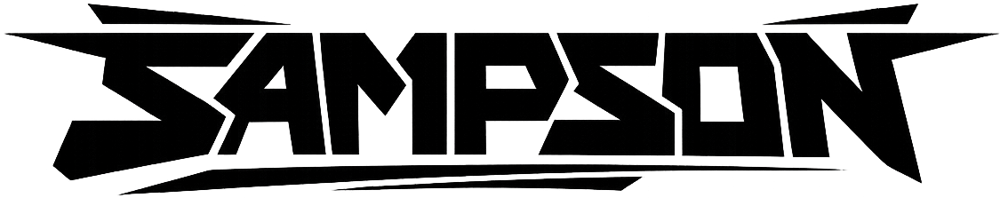

<p align="center">
  
</p>

**Universal Audio Sample Manager** — a cross-platform desktop app (Windows, Linux) for organising audio sample libraries for hardware samplers. Browse a source library, hear files before you move them, preview exactly how they'll be renamed and structured, then copy or move them in one click.

> Pre-built binaries (Windows .exe and Linux binary) available on the [Releases](https://github.com/irpina/Splice-Sample-Flattener/releases) page — no Python required.

---

## Features

- **Audio playback** — click any file in the preview to hear it instantly; navigate with ◀ ▶ ▶▶ transport controls or arrow keys
- **Hardware profiles** — path-limit enforcement for specific devices:
  - **Generic** — no limit
  - **M8** — 127-character SD path limit (Dirtywave M8)
  - **MPC One** — 255-character limit
  - **SP-404mkII** — 255-character limit
- **Folder structure modes** — choose how files land in the destination:
  - **Flat** — all files together in one folder
  - **Mirror** — preserve the full source directory tree
  - **One folder per parent** — group by immediate parent folder name
- **Rename pattern** — files are prefixed with their parent folder name (`Kicks_kick_01.wav`), keeping context in a flat folder. Disable with **Keep original names**.
- **Live preview** — Deck B shows every file alongside its renamed form before you commit; hover for a full-path tooltip
- **Copy or Move** — copy (default, non-destructive) or move
- **Dry run mode** — default-on; logs every action without touching the filesystem
- **Operation log** — colour-coded (red = move, green = copy, yellow = dry run, cyan = done)
- **Dark / Light theme** — MD3 near-black palette or warm 60s/70s pastels; toggle preserves your session
- **HiDPI / 4K support** — DPI-aware on Windows; scales via system settings on Linux/macOS

### Supported formats

`.wav` · `.aiff` · `.aif` · `.flac` · `.mp3` · `.ogg`

---

## Download

Grab the latest `SAMPSON.exe` from the [Releases](https://github.com/irpina/Splice-Sample-Flattener/releases) page and run it — no installation or Python needed.

---

## Running from source

```bash
pip install pygame-ce
python main.py
```

Requires Python 3.10+. All UI is standard-library tkinter; `pygame-ce` is the only third-party dependency (audio playback).

---

## Usage

1. **Set the source (Deck A)**
   - Click **Browse** or type a path into the source field.
   - The file browser populates with subfolders and audio files.
   - Click a folder to navigate into it; click **↑** or `..` to go up.

2. **Set the destination (Deck B)**
   - Click **Browse** or type a path.

3. **Preview and listen (Deck B)**
   - The table shows every audio file found alongside its renamed form.
   - **Click any row** to hear the file. Use **◀ ▶ ▶▶** buttons or **↑ / ↓** arrow keys to navigate and auto-play.
   - Hover over a name in the **Will become** column for a full-path tooltip.

4. **Configure options (centre panel)**

   | Option | Default | Description |
   |--------|---------|-------------|
   | Move files | Off | Move instead of copy. Off = copy (safe). |
   | Dry run | **On** | Log actions without writing files. Turn off to commit. |
   | Keep original names | Off | Skip the folder-prefix; keep original filenames. |
   | Folder structure | Flat | How files are arranged in the destination. |
   | Hardware profile | Generic | Enforces device-specific path length limits. |

5. **Click Run** (or press **Enter**)
   - The status bar and log panel update in real time.
   - Use **Clear log** to reset between runs.

---

## How renaming works

By default, each file is prefixed with the name of its immediate parent folder:

```
Source:       Drums/Kicks/kick_01.wav
Destination:  Kicks_kick_01.wav
```

This keeps a flat destination usable on hardware samplers while preserving context. Enable **Keep original names** to skip the prefix entirely.

When a hardware profile with a path limit is selected, the filename stem is silently truncated so the full destination path fits within the device's limit — the extension is always preserved.

---

## Theming

Click **☀ Light** / **☾ Dark** in the top-right corner to switch themes. Source, destination, and browser position are all restored after the toggle.

| Theme | Deck A accent | Deck B accent |
|-------|--------------|--------------|
| Dark  | Cyan `#4dd0e1` | Amber `#ffb74d` |
| Light | Avocado sage | Terracotta |

---

## Project structure

```
SAMPSON/
├── main.py          # entry point — DPI setup, creates root window, starts app
├── state.py         # all shared mutable globals (widgets, vars, flags)
├── constants.py     # AUDIO_EXTS, MAX_PREVIEW_ROWS, hardware PROFILES
├── dpi.py           # Windows DPI awareness and _px() scaling helper
├── theme.py         # colour constants, _apply_theme_colors(), setup_styles()
├── log_panel.py     # operation log helpers
├── operations.py    # file copy/move worker, _compute_output(), path truncation
├── browser.py       # Deck A file browser — navigation and browse dialogs
├── preview.py       # Deck B rename preview, hover tooltip, background scan
├── playback.py      # audio playback via pygame-ce, transport controls
└── builders.py      # all build_* UI functions, toggle_theme(), build_app()
```

---

## Limitations

- Preview is capped at **500 rows** for performance; the file count still reflects the full total.
- The file browser only shows non-hidden subfolders and audio files.
- Destination collisions are not handled — if a renamed file already exists at the target it will be overwritten silently.
- Windows only (DPI awareness and PyInstaller packaging are Windows-targeted; the source may run on macOS/Linux with minor adjustments).
